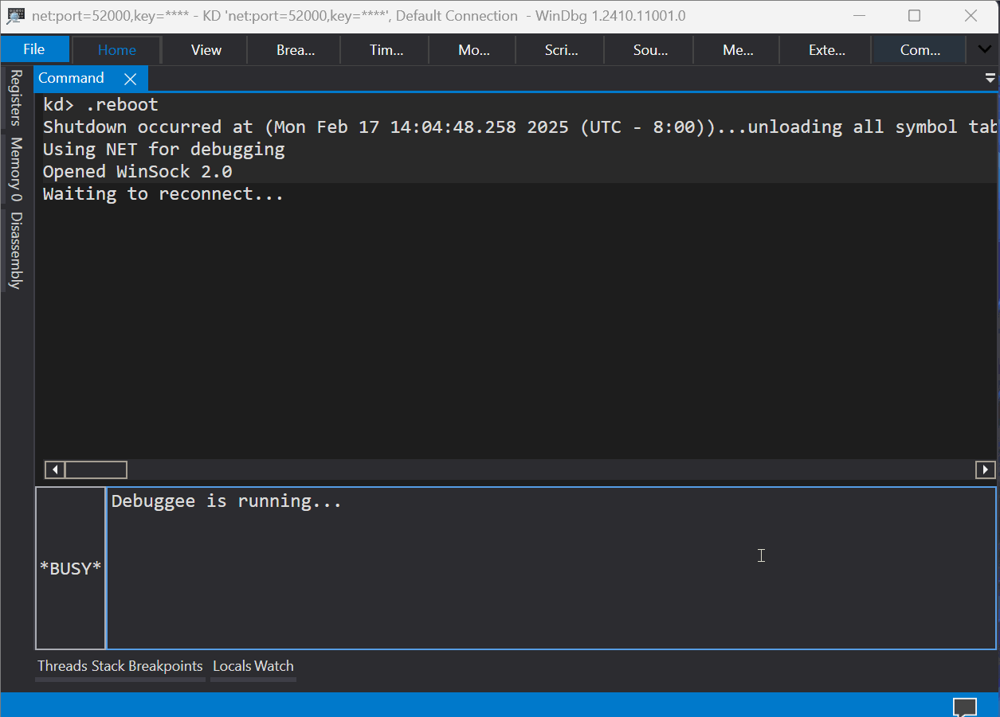

# hvext

The Windbg extensions to study Hyper-V on Intel and AMD processors.

- [hvext](#hvext)
  - [Setup](#setup)
  - [Usage on Intel](#usage-on-intel)
  - [Usage on AMD](#usage-on-amd)
  - [References and acknowledgement](#references-and-acknowledgement)


## Setup

Attach the debugger to Hyper-V on a target. See [Setting up KDNET over USB EEM for Bootloader and Hyper-V debugging](https://tandasat.github.io/blog/windows/2023/03/21/setting-up-kdnet-over-usb-eem-for-bootloader-and-hyper-v-debugging.html) for details.

If you encounter stability issues, consider making the target a single core with:
```
> bcdedit /set numproc 1
```


## Usage on Intel

1. Wait for the debugger to establish connection. Let the target run if the debugger breaks-in at initial connection. This extension does not function at this stage since processors are not in VMX root operation yet.

2. Manually break-in the target Hyper-V.

3. Load the script, for example:
    ```
    kd> .scriptrun C:\Users\user\Desktop\hvext\hvext_intel.js
    JavaScript script successfully loaded from 'C:\Users\user\Desktop\hvext\hvext_intel.js'
    hvext loaded. Execute !hvext_help [command] for help.
    ```

4. Execute commands.
    ```
    kd> !hvext_help
    hvext_help [command] - Displays this message.
    dump_dmar [pa] - Displays status and configurations of a DMA remapping unit.
    dump_ept [verbosity] - Displays guest physical address translation managed through EPT.
    dump_hlat [verbosity] - Displays linear address translation managed through HLAT.
    dump_io - Displays contents of the IO bitmaps.
    dump_msr [verbosity] - Displays contents of the MSR bitmaps.
    dump_vmcs - Displays contents of the current VMCS.
    ept_pte [gpa] - Displays contents of EPT entries used to translated the given GPA.
    indexes [address] - Displays index values to walk paging structures for the given address.
    pte [la] - Displays contents of paging structure entries used to translated the given LA.

    Note: When executing some of those commands, the processor must be in VMX-root operation with an active VMCS.
    ```


## Usage on AMD



1. Wait for the debugger to break-in at initial connection, or manually break-in the target.

2. Load the script, for example:
    ```
    kd> .scriptrun C:\Users\user\Desktop\hvext\hvext_amd.js
    JavaScript script successfully loaded from 'C:\Users\user\Desktop\hvext\hvext_amd.js'
    ..................................................................
    bp hv+0x339d34 ".echo Breakpoint 0 hit; r rax"
    bp hv+0x339d51 ".echo Breakpoint 1 hit; r rax"
    bp hv+0x38f788 ".echo Breakpoint 2 hit; r rax"
    bp hv+0x38f97c ".echo Breakpoint 3 hit; r rax"
    bp hv+0x3902f9 ".echo Breakpoint 4 hit; r rax"

    To find the address of a VMCB, break on VMRUN using the above bp commands.
    hvext loaded. Execute !hvext_help [command] for the help message.
    ```

3. Set breakpoints as instructed and let the target run until it hits one of the breakpoints.
    ```
    kd> bp hv+0x339d34 ".echo Breakpoint 0 hit; r rax"
    kd> bp hv+0x339d51 ".echo Breakpoint 1 hit; r rax"
    kd> bp hv+0x38f788 ".echo Breakpoint 2 hit; r rax"
    kd> bp hv+0x38f97c ".echo Breakpoint 3 hit; r rax"
    kd> bp hv+0x3902f9 ".echo Breakpoint 4 hit; r rax"
    kd> g
    ```

4. Once the breakpoint is hit, confirm the address of VMCB (in this case, 0x102261000).
    ```
    Breakpoint 0 hit
    rax=0000000102261000
    hv+0x339d34:
    fffff876`66f39d34 0f01da          vmload  rax
    ```

5. Execute commands.
    ```
    kd> !hvext_help
    hvext_help [command] - Displays this message.
    dump_io <pa> [,verbosity] - Displays contents of the IO permissions map.
    dump_msr <pa> [,verbosity] - Displays contents of the MSR permissions map.
    dump_npt <ncr3> [,verbosity] - Displays guest physical address translation managed through NPT.
    dump_vmcb <pa> [,verbosity] - Displays contents of the VMCB.
    indexes [address] - Displays index values to walk paging structures for the given address.
    pte [address [,pml4]] - Displays contents of paging structure entries used to translated the given address.
    ```

    ```
    kd> !dump_vmcb 0x102261000
    VMCB @ 0x102261000
    +0x000: 0x0 -- Intercept reads of CR0-15
    +0x002: 0x0 -- Intercept writes of CR0-15
    +0x004: 0x0 -- Intercept writes of DR0-15
    ...
    ```


## References and acknowledgement
- [@ergot86's implementation](https://github.com/ergot86/crap/blob/main/hyperv_stuff.js) as the base of this script.
- [@0vercl0k's amazing introduction](https://doar-e.github.io/blog/2017/12/01/debugger-data-model/) to Windbg Preview, including authoring extensions.
- [@gerhart_x's IDA Python scripts](https://github.com/gerhart01/Hyper-V-scripts/blob/master/display-vmcs.py) for IDA Pro users (instead of Windbg).
- [@KelvinMsft](https://x.com/KelvinMsft) for answering a few questions.
